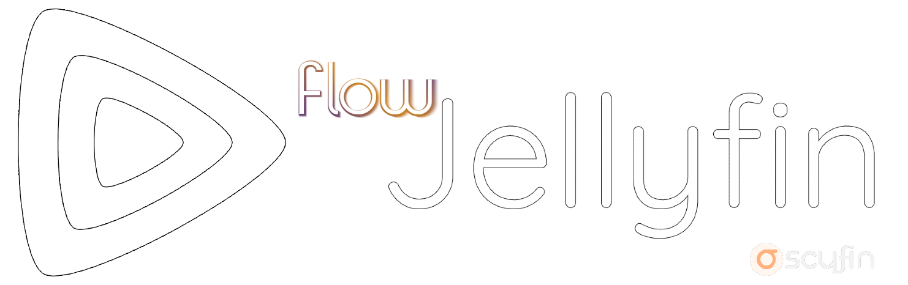

# **Plex-inspired theme for Jellyfin WebUI**
### **Built on [Scyfin](https://github.com/loof2736/scyfin/), compatible with themes**

[Go to installation](#installation)

Also avaliable as a [Userstyle](https://userstyles.world/style/21576/flow-for-jelyfin)

---
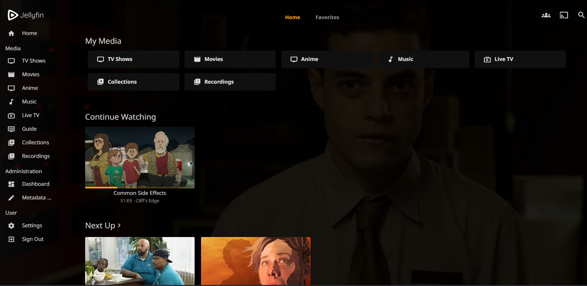

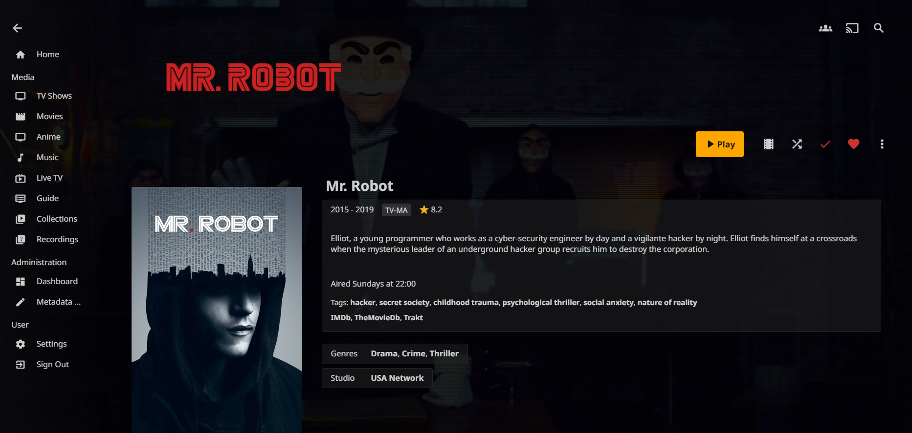

### **Outline Cards on hover**

### **Backdrop Support**
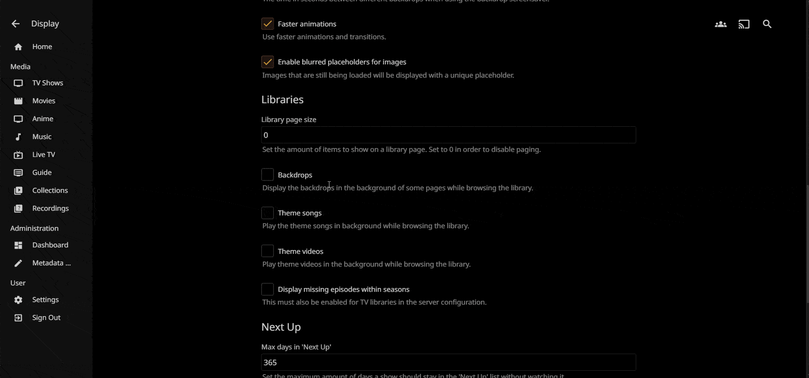

### Base Theme
`@import url('https://cdn.statically.io/gh/LitCastVlog/Flow/main/CSS/ScyFlow-main.css');`

### Extras (*smaller cast/crew, etc*) 
`@import url('https://cdn.statically.io/gh/LitCastVlog/Flow/main/CSS/ScyFlow-Extras.css');`

 - B/W Logo (credits: [RoyalxZealot](https://www.steamgriddb.com/logo/128502))
 - Smaller Cast/Crew section
 - Hide "Upcoming on TV" and "Next Up" section in Season View

### Options (Add these after/under the base theme)
- Enable Collapsable Drawer/Menu 
    - `@import url('https://cdn.statically.io/gh/LitCastVlog/Flow/main/CSS/ScyFlow-Drawer-Toggle.css');`
      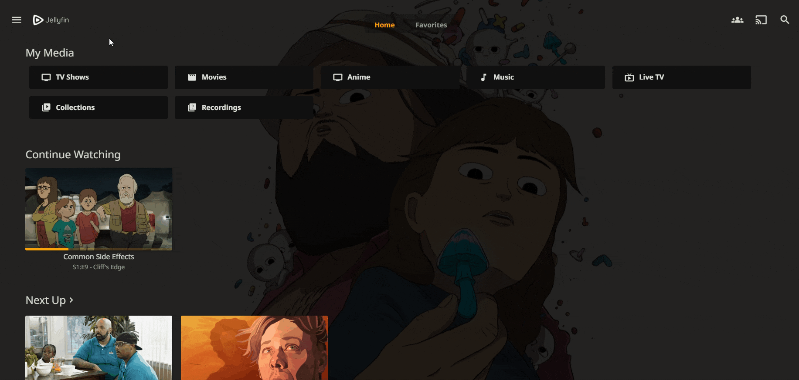
- Bigger logo (for High DPI/Jellyfn Media Player)
    - `@import url('https://cdn.statically.io/gh/LitCastVlog/Flow/main/CSS/ScyFlow-HighDPIExtras.css');`
      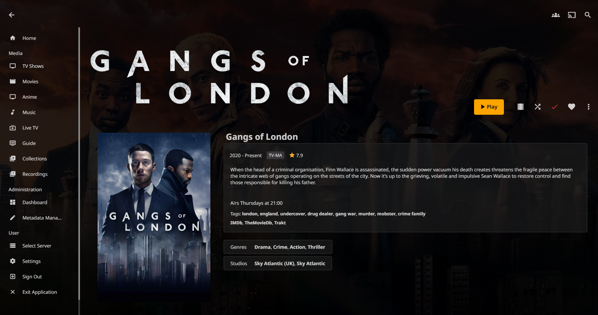      
- Themes:
    - Orange
        - `@import url('https://cdn.statically.io/gh/LitCastVlog/Flow/main/CSS/Themes/ScyFlow-Orange.css');`
        - 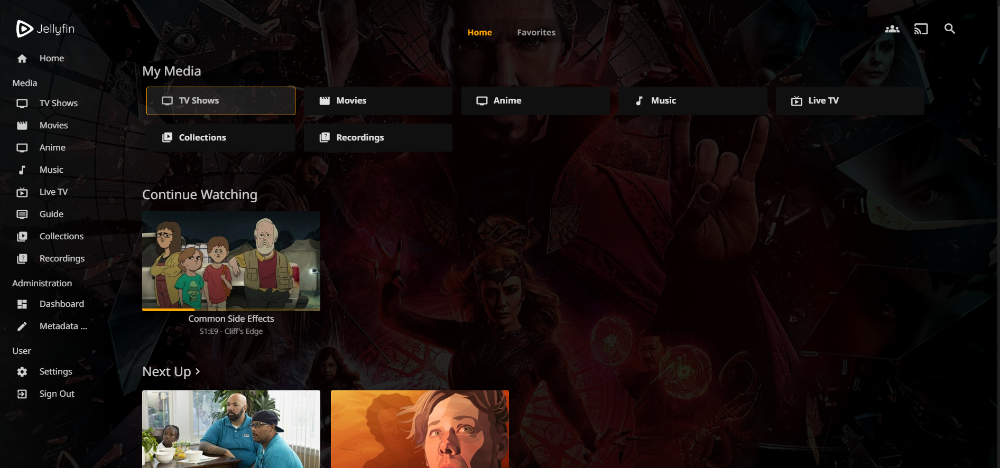
    - White
        - `@import url('https://cdn.statically.io/gh/LitCastVlog/Flow/main/CSS/Themes/ScyFlow-White.css');`
        - 
    - Blue
        - `@import url('https://cdn.statically.io/gh/LitCastVlog/Flow/main/CSS/Themes/ScyFlow-Blue.css');`
        - 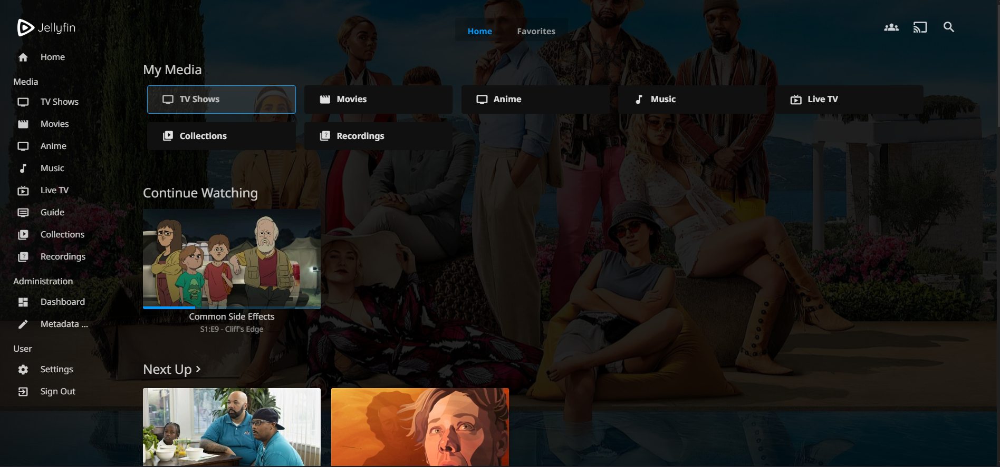

   - Darker icons/accents (Add this after everything else):
        - `@import url('https://cdn.statically.io/gh/LitCastVlog/Flow/main/CSS/Themes/ScyFlow-Dark.css');`
   
  # Compatible with Scyfin themes:     
    - Seafoam
        - `@import url('https://cdn.jsdelivr.net/gh/loof2736/scyfin@latest/CSS/theme-seafoam.css');`
    - Coral
        - `@import url('https://cdn.jsdelivr.net/gh/loof2736/scyfin@latest/CSS/theme-coral.css');`
    - Snow
        - `@import url('https://cdn.jsdelivr.net/gh/loof2736/scyfin@latest/CSS/theme-snow.css');`
    
---

### **Installation:**

### Easy install (one liner) 
`@import url('https://cdn.statically.io/gh/LitCastVlog/Flow/main/CSS/ScyFlow-oneliner.css');` 

  - **Mobile/App fixes:** *if the logo is too big or doesn't apply (iOS, Android), append this line as well (per client)* 
       - `@import url('https://cdn.statically.io/gh/LitCastVlog/Flow/main/CSS/ScyFlow-mobilefixes.css');`
          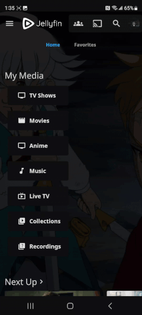

**Server-wide install:**
* Click the hamburger icon (Top left)
* Navigate to "Dashboard" (If you don't see this, make sure you are signed in to your admin account)
* Navigate to "General"
* Near the bottom, under "Custom CSS code", paste the `@import url` for the base theme
    * Example:
    * 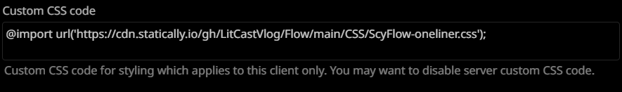
* Optional - Paste the `@import url` for any options / themes you may want
    * Example:
    * 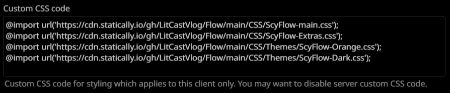
* Click "Save"

---

**Single client install:**
* Click the hamburger icon (Top left)
* Navigate to "Settings"
* Navigate to "Display"
* Near the middle, under "Custom CSS code", paste the `@import url` for the base theme
    * Note - 
        * If there is any server-wide custom CSS, you may want to enable "Disable server-provided custom CSS code", as the two themes WILL interfere with each other
    * Example:
    * 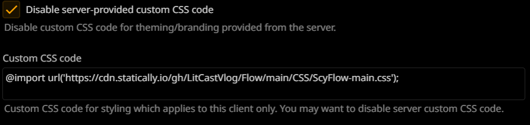
* Optional - Paste the `@import url` for any options / themes you may want
    * Example:
    * 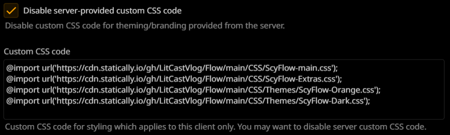
* Click "Save"
